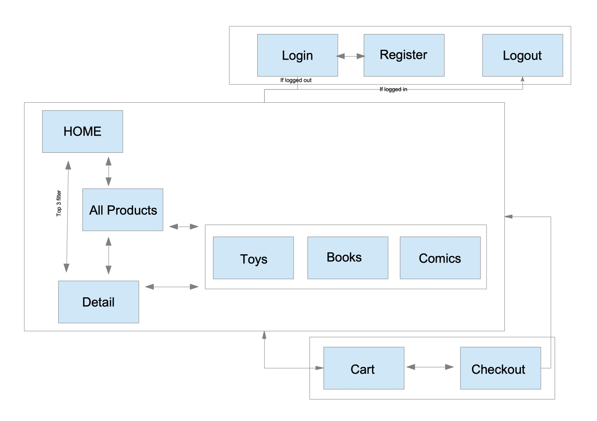
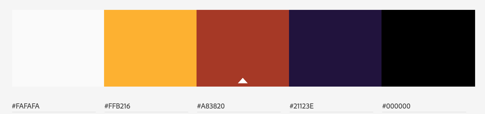

# GoS

# FULLSTACK DJANGO ECOMMERCE PROJECT

## Project Overview

The project presented [here](https://fullstack-ecom.herokuapp.com/) is an imagined e-commerce site. The people at GoS are in the business of selling comics and graphic novels, toys and collectables related to comics and graphic novels, and some classic and modern Sci-Fi novels. A real world version would be something like [Forbidden Planet](https://forbiddenplanet.com/).

I would imagine the store to have a long standing high street presence, with one or two stores in couple of cities around the country. This site represents their first entry to the online market.

The goals of this project are to:

- Continue to develop general Python skills.
- Get some experience in a fullstack framework like Django.
- Work with relational DB systems using the Django ORM.
- To further my experience of deployment to Heroku.
- To work with the Strip API.
- To keep my models and apps relativley simple while allowing for future complexity.
- to make it a plesent experience for a user.

### User Stories

##### As a user I want to ...
  - quickly understand whats on offer at this site.
  - search for items I'm interested in.
  - filter the content presented by category i.e. I'm here to look at comics, I dont need to see toys.
  - have navigatation of the site to be easy and intuative. 
  - sort items by price (high-to-low and low-to-high).
  - have access to detailed information about products.
  - add products to a cart as I browse.
  - be able to access my cart easily.
  - be able to edit my cart by adding or deleting items.
  - be able to register for the site.
  - know if I am logged in with some personalisation. 
  - be able to leave a comments and ratings for products.
  - see what others have said about products.
  - see an average of all ratings for each product.
  - know if an item is in stock or not, this should include items in cart(s).
  - be able to log out.

### Data Model

The data schema is constructed through the Django ORM. Data is stored in a locally hosted SQLITE instance for development and in a remote PostgreSQL instance when deployed for production.

#### Category

Each product is one of three possible categories

                                    Table "public.products_category"
        Column  |         Type          | Collation | Nullable |             Default              
        ----------+-----------------------+-----------+----------+----------------------------------
        id       | bigint                |           | not null | generated by default as identity
        category | character varying(80) |           | not null | 
        Indexes:
            "products_category_pkey" PRIMARY KEY, btree (id)
        Referenced by:
            TABLE "products_brand" CONSTRAINT "products_brand_category_id_fkey" FOREIGN KEY (category_id) REFERENCES products_category(id)
            TABLE "products_kind" CONSTRAINT "products_kind_category_id_fkey" FOREIGN KEY (category_id) REFERENCES products_category(id)
            TABLE "products_product" CONSTRAINT "products_product_category_id_fkey" FOREIGN KEY (category_id) REFERENCES products_category(id)

#### Product
The main model for all products.
Note: the __kind_id__ and __views__ fields are not utilised in this project but may be in the future.

- id: PK
- name, description, price and image are static fileds, simply rendered, they don't change on user interaction with site.
- category_id: 1-M FK relationship with the Category table, delete cadcades to Products
- stock: count of physical instances of this product
- cart_stock: count of physical instances of this product less whats currently in carts
- sales: amount of this product which has cleared through checkout

                                        Table "public.products_product"
        Column    |          Type          | Collation | Nullable |             Default              
        -------------+------------------------+-----------+----------+----------------------------------
        id          | bigint                 |           | not null | generated by default as identity
        name        | character varying(254) |           | not null | 
        description | text                   |           | not null | 
        price       | numeric                |           | not null | 
        image       | character varying(100) |           | not null | 
        views       | bigint                 |           | not null | 
        category_id | bigint                 |           | not null | 
        kind_id     | bigint                 |           | not null | 
        stock       | bigint                 |           | not null | 
        sales       | bigint                 |           | not null | 
        cart_stock  | bigint                 |           | not null | 
        Indexes:
            "products_product_pkey" PRIMARY KEY, btree (id)
            "products_product_category_id_9b594869" btree (category_id)
            "products_product_kind_id_027afdd1" btree (kind_id)
        Foreign-key constraints:
            "products_product_category_id_fkey" FOREIGN KEY (category_id) REFERENCES products_category(id)
            "products_product_kind_id_fkey" FOREIGN KEY (kind_id) REFERENCES products_kind(id)
        Referenced by:
            TABLE "checkout_orderlineitem" CONSTRAINT "checkout_orderlineitem_product_id_fkey" FOREIGN KEY (product_id) REFERENCES products_product(id)
            TABLE "reviews_review" CONSTRAINT "reviews_review_product_id_fkey" FOREIGN KEY (product_id) REFERENCES products_product(id)

#### Review

 - id: PK
 - product_id: 1-M FK constraint
 - user_id: 1-1 FK constraint
 - created: timestamp crated on submission of review form
 - comment: users comment
 - rating: users rating

                                        Table "public.reviews_review"
        Column   |            Type             | Collation | Nullable |             Default              
        ------------+-----------------------------+-----------+----------+----------------------------------
        id         | bigint                      |           | not null | generated by default as identity
        comment    | character varying(254)      |           | not null | 
        created    | timestamp without time zone |           | not null | 
        product_id | bigint                      |           | not null | 
        user_id    | bigint                      |           |          | 
        rating     | bigint                      |           | not null | 
        Indexes:
            "reviews_review_pkey" PRIMARY KEY, btree (id)
            "reviews_review_product_id_ce2fa4c6" btree (product_id)
            "reviews_review_user_id_875caff2" btree (user_id)
        Foreign-key constraints:
            "reviews_review_product_id_fkey" FOREIGN KEY (product_id) REFERENCES products_product(id)
            "reviews_review_user_id_fkey" FOREIGN KEY (user_id) REFERENCES auth_user(id)

### UX

#### System Architecture

#### Wireframes

[Here](static/images_rm/)

#### Brand

I imagine the brand for this site to be a play on Sci-Fi tropes, i.e a bit mysterious and playful with the content but serious when getting to the real business. This idea should feed through the site content.

#### Typography

Cute Font is a cursive font. I choose this font initially as it renders the charcaters G O S in a way that makes them slightly ambiguous, they could be read as 6 0 5. I think this fits with the brand of the site.

With a font like this it is easy to overkill, to this end it is used sparingly and never in paragraph text.

Cute Font was used for:
 - Site Name
 - Product Name
 - Footer text

 Lato is sans serif. While being nicley readable, it is semi-rounded and therefore compliments the Cute text well. It also works well as bold text.

 Lato was used in:
 - Paragraphs
 - Category links
 - Buttons
 - Forms

#### Colour

Dark Black for the Navbar works well with the Purple used as the main background colour. While maintaining a dark shell around the lighter content, they are also distinct from each other.
The Purple is used to convey that sense of mystery as required by the site brand.

The cards are Bootstrap, with a White background colour and black text. The product name in Cute Font use the same Purple as the container background. Ive used a dark red to block out the card content.

The text outside of the cards is White, allowing for contrast with the darker background. The red is used again for < hr > elements.

## Features
### Apps

- Home
- Products
- Cart
- Checkout
- Reviews
- Search
- Accounts

#### Navigation

The Navabr is made up of two elements. 
 1. A Bootstrap < nav > element
    - If user is logged in we display the user's username.
    - Brand name, links to home page.
    - Product catgory links. The 'path' element of the request is queried to display the relevent category as an "active" element.
    - Icons links to log in/out register
    - A count of cart items
 2. A Bootstrap < container-fluid > element
    - Search Bar
    - Browse All Products link
    - If viewing all products, a sort by price dropdown

#### User

Non logged in users have access to all features besides leaving a review.

Users can register via a simple form. Once registered users can reset their email address.

Logged in users have their name displayed in the Navbar, can add reviews and rating for products, logout.

#### Detailed Product Views

In the multi product views a products description is truncated to 10 words with a prompt to click for more information. This links to new page where the card is full width and the entirity of a product's information is displayed. On mobile screens, if a description goes over 120 characters it is again truncated with an option to display more. This triggers a dropdown rather than loading a new page.

A button to add items to your cart. The max quantity a user is allowed to add is rendered from the **cart_stock** value in the db.

We also display a form where logged in users can leave a comment and select a rating for a product. On submit the review is rendered ordered by timestamp.

#### Search / Filter / Sort

Search is full text query using Django **icontains** on the name and description fields for products.
Products can be filtered by category via links in the Navbar.
When in all products view, products can be sorted by price in both directions.

#### Pagination

All products and category views use Django pagination.

#### Stock

Each product has a value for **stock** and **cart_stock**.

For each item processed via the checkout, the quantity in the cart is subtracted from the stock value and the db is updated.
When the quantity of product added to the cart reaches the max total of **cart_stock** in the db, no more of that item can be added to the cart. Subsequently if a user removes or alters an items quantity when in the cart, this amount is added back onto the amount available to the users.
On successfull payment, **stock** and **cart_stock** are realigned in the db.

#### Sales
On the home page each carousel is displaying the top three sold items. The sales value is read from the db and updated on sucessful checkout.

#### Cart
Users can add items to their cart, view current cart, alter quantity of a cart item, remove an item from the cart.

#### Checkout
As with cart, users can add, edit and remove items. The checkout uses Stripe to process payments.

#### Review
Logged in users can leave review and rate products.

#### Left to Implement

The product model should have distinct classes for each category of product. With this in place each type of product could contain bespoke details, books can have authors and toys can have brand for example.

Stock control should be its own app to afford it more complexity. Currently the stock in a cart is only factored into the UX once it hit zero. In a future developement each tick of the quantity button would be calculated to give the user feedback.

From testing I found a few bugs the stock/cart system, for example if a user adds all available of an item to the cart they cannot, once in cart view, remove quantities via the input, they need to remove the whole item and start again. 

I see this site as having a loyal customer base. I would extend the logged in user element by creating a members area. Members could avail of special offers, organise meet ups to play Dungeons and Dragons, get first on list for pre orders and special items.

An auction feature for rare items like Spiderman #1 or a signed copy of The Watchmen etc.

## Testing

Besides checking data types, there is no real useful automated testing.

Manual Testing through development of the site consisted of asking the following questions each time a significant feature was added, removed or changed. 

What happens:

- when users click links, are they ever confused about where they are, do they have further options, can they always get home
    - logged in
    - not logged in
    - after initial register
    - after logging out
- when user enter incorrect username/password
- to the cart and add button when a user adds or removes items from their cart
- when a user removes cart items and proceeds through checkout
- when a user adds a review comment but not a rating and vice versa

Is the messaging correct when a user goes through the reset password process.

Functions where the db is updated were tested against the database, both locally as SQLITE and once deployed as Postgres.

The remote Postgres DB can be connected to via the terminal using the PSQL command line tool and the credentials available on the Heroku site.

For example, I can add a quantity of the novel 'Foundation' to the cart and query the db for expected results.

        id |    name    | stock | cart_stock | sales 
        ----+------------+-------+------------+-------
        23 | Foundation |     1 |          0 |    45
        (1 row)

I can remove it from the cart and check again:

        id |    name    | stock | cart_stock | sales 
        ----+------------+-------+------------+-------
        23 | Foundation |     1 |          1 |    45

Re add to cart, proceed through checkout and query again:

        id |    name    | stock | cart_stock | sales 
        ----+------------+-------+------------+-------
        23 | Foundation |     0 |          0 |    46

##### Users

The site was tested to see if each of the user stories outlined above were met.
In order to assess the sites usability I have shared it for testing with some fiends and collegues and resonded to feedback where possible.

##### Responsiveness

The site as vigorously tested in Chrome Developer Tools in responsive mode and at all screen sizes on a variety of device brands. This involved selecting _inspect_ and the _toggle device toolbar_ options. Then selecting through common devices (Galaxy S5, Google Pixel devices, iPhones of various sizes, iPad, iPad Pro) in order to see if my Bootstrap Grid set up allowed the text and charts to flow and flex without any visual or technical issues.
The site was also physically tested on a Samsung Galaxy Tab, an iPhone 6, a Windows Desktop machine and a Retina Screen MacBook Pro.

##### Browsers
The site was tested in Chrome, FireFox, Safari and Opera.
 
### Validation

CSS files where found to be valid via the offical W3 code validators.

CSS : https://jigsaw.w3.org/css-validator/

HTML has not been validated or commented as html as neither will work in a django template

JavaScript files were tested at : https://jshint.com/

Python was checked for Pep* compliance at : http://pep8online.com/

## Deployment

I used a 'walking the skelethon' approach, deploying early to Heroku.

The site is deployed to Heroku under the following process:

1. Git (versioning)
    - Create a local git respositry in your project
    - Create a .gitignore
    - Create a readme.md
    - Do: git add .
    - Do: git commit -m "some relevent message"
2. Github (versioning)
    - Create a new repo
    - Give it a name
    - push your local existing git repository from the command line
3. Travis (continuous integration)
    - Search for and link to your git repo
    - Copy you status image text as markdown and paste at the top of your readme.md
    - In your project folder create a .travis.yml with relevent info (language etc.)
    - Add, Commit and Push to git
    - Trigger a build
    - Fix any issues and repeat until you see the green 'passing' icon
4. In Heroku (deployment)
    - Create a new app
    - Provision a PostgreSQL instance 
    - Under Settings access the Config Vars, your DB URI should automatically be in place
    - In your project make sure to have whitenoise, dj-database-url, psycopg2 and gunicorn installed
    - In your project folder create a Procfile with the gunicorn server referenced 
    - Add subsequent variables:
        - COLLECTSTATIC : 1
        - EMAIL_ADDRESS and EMAIL_PASSWORD for password reset feature
        - Django SECRET_KEY (from generated setting.py on running startproject)
        - STRIPE_PUBLISHABLE and STRIPE_SECRET provided by Stripe
    - Under Deploy 
        - Deployment Method: Connect to GitHub
        - Follow guidlines to connect the app to the GitHub repo
    - Push from git
    - Once the project is built by Heroku, open the app
    - Debug any issues present in the logs
    - Allow automatic deploys
    - Select: Wait for CI to pass before deploy

### How to clone locally

The site can be cloned from GitHub and ran locally by following the following steps:

- Go to my [repo](https://github.com/select-8/fullstack-ecomm)
- Click the Clone or Download option
- Copy tyhe Url
- In your local environment, wherever you want to store the code do: 
    - git clone < the copied url >
- The repo will be downloaded
- cd into it in terminal
- Create yourself a virtual environment, I used pipenv
    - sudo pip3 install pipenv.
- To start the shell environment, do:
    - pipenv shell 
- Install project requirments using the requirments.txt file
    - pipenv install -r requirements.txt
- Create your db
    - python3 manage.py migrate
- Create a .env to set environment variables (see setting.py for what you need to set)
- Create a superuser for the Django admin panel
    - python3 manage.py createsuperuser
- Start the server
    - python3 manage.py runserver

## Technologies Used

##### LANGUAGES
- [HTML](https://www.w3.org/html/)
- [CSS](https://www.w3.org/Style/CSS/Overview.en.html)
- [JavaScript](https://www.javascript.com/)
- SQL
- [Python](https://www.python.org/)

##### VERSION CONTROL
- [GIT](https://git-scm.com/)

##### Deployment
- [HEROKU](heroku.com)

##### Environment
- [pipenv](https://github.com/pypa/pipenv)

Create virtual python environments.

Use pipenv install ... to install project requirments 

##### FRAMEWORKS

- [Django](https://www.djangoproject.com/)

    - Used to build the web application
    - Dependencies 
        - [dj-database-url](https://pypi.org/project/dj-database-url/) DB config from Django
        - [whitenoise](http://whitenoise.evans.io/en/stable/)  Static file serving for Python web apps
        - [django-forms-bootstrap](https://github.com/pinax/django-forms-bootstrap#django-forms-bootstrap) Bootstrap filter for Django forms
        - [gunicorn](https://gunicorn.org/) Python WSGI HTTP Server for UNIX
        - [Pillow](https://pillow.readthedocs.io/en/stable/#)
        - [psycopg2](https://pypi.org/project/psycopg2/) PostgreSQL database adapter for Python

- [Stripe](https://stripe.com/ie)

API for processing online payments

- [Bootstrap](https://getbootstrap.com/)

To create a responsive grid

- [jQuery](https://jquery.com/)

To create the dropdown effect for detail product views on mobile

##### APIs
 - [Google Fonts](https://fonts.google.com/)
 - [fontawesome](https://fontawesome.com/)

##### SOFTWARE AND SERVICES
- [Visual Studio Code](https://code.visualstudio.com/)
- [GitHub](https://github.com/)

##### Database
- For local development I used [sqlite](https://www.sqlite.org/index.html)
- On Heroku, [PostgreSQL](https://www.postgresql.org/) was used 

I added most of the content locally to my sqlite instance. In order to not have to repeat this process in Postgres I used a Ruby command line tool to push my sqlite data to a newly provisioned i.e. empty, Postgres instance provided by heroku.

        gem install sequel pg sqlite3
        sequel -C sqlite:///Path/to/your/db.sqlite3 POSTGRES_URI
    
The POSTGRES_URI can be copied from the DB credential settings on Heroku.

##### EDITORS
- SUBLIME
- ATOM

##### VMWARE
- UBUNTU V18.04

##### HARDWARE
- MAC OSX

##### PROJECT MGMT
- SLACK
- NOTION

## Credits

The Django documentation was used heavily.

The project was built out from the Code Institute's Ecommerce walk through.

[This](http://shopnilsazal.github.io/django-pagination-with-basic-search/) for pagination with search

[This](https://www.viralpatel.net/dynamically-shortened-text-show-more-link-jquery/) For jQuery short descriptions by screen size

[This](https://github.com/Code-Institute-Submissions/gorgeous-online-shop) code institute student submission provided some inspiration for the sort function (thanks whoever you are)

